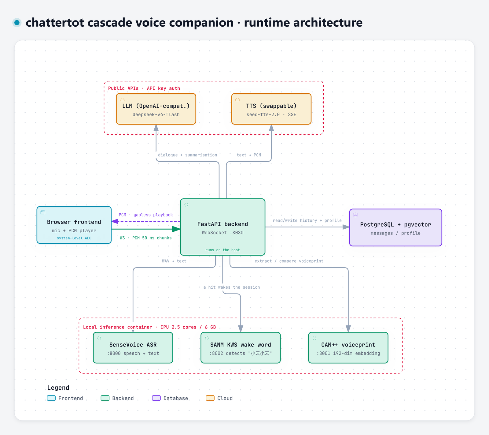

# chattertot

**A self-hosted voice companion for children.**

Say its name to wake it, just talk to hold a conversation, and interrupt mid-sentence if you like.
The compute-heavy parts — speech recognition, voiceprint, wake word — run locally on your own CPU.
Only the LLM and the speech synthesis are calls out, and both are swappable for models you host
yourself.

**English** | [简体中文](README.zh-CN.md)



<sub>Interactive version (clickable nodes with source-code evidence, dark mode):
[docs/architecture/chattertot-architecture.en.html](docs/architecture/chattertot-architecture.en.html)</sub>

---

## What it does

- **Wake word** — say "小云小云" (xiǎo yún xiǎo yún). Say the wake word *and* your question in one
  breath ("小云小云, tell me a story") and it answers directly.
- **Continuous conversation** — no button pressing. It detects when you've finished a sentence and
  replies.
- **Barge-in** — say the wake word while it's talking and it stops immediately.
- **Stories, riddles, songs** — a gentle big-sister persona ("小云").
- **Two-tier memory** — recent turns plus a long-term profile (name, preferences, family, stories
  already told), so it doesn't repeat itself.

## Why it's built this way

Four decisions shape everything else; each one exists because the obvious alternative failed.

| Decision | Why |
|---|---|
| **Cascade, not end-to-end** | End-to-end realtime speech APIs bill by audio duration, which can't sustain "a child chatting nonstop". Splitting recognition → LLM → synthesis lets the CPU-heavy parts run locally, so money is only spent on the LLM and TTS. |
| **Voiceprint per turn, never stored** | Children's voices drift as they grow. A globally enrolled voiceprint gradually stops matching — and enrolment is a burden on a child. Deriving one per turn and releasing it afterwards removes the drift problem entirely. |
| **Barge-in on the wake word, not an energy threshold** | An energy threshold mistakes ambient noise, bystanders and the AI's own residual echo for interruptions, so the AI constantly interrupts itself. |
| **Wake utterance with a question → answer directly** | Acknowledging first ("I'm here!") leaves a gap that makes children think they weren't heard, so they repeat themselves — and get two answers. |

---

## Architecture

```
Browser  ──WebSocket(PCM)──▶  FastAPI backend  ──HTTP──▶  SenseVoice ASR
(mic / system AEC)            (state machine,             local CPU, Docker
                               VAD / end-of-turn)              │
                                   │                           │
                                   ├──HTTP──▶  CAM++ voiceprint ─┤  (all local, CPU)
                                   ├──HTTP──▶  SANM KWS (wake) ──┘
                                   │
                                   ├──HTTP──▶  LLM   (OpenAI-compatible — self-hostable)
                                   ├──HTTP──▶  TTS   (streaming — swappable)
                                   └──SQL───▶  PostgreSQL + pgvector
                                               (history + long-term memory)
```

| Layer | Component | Where it runs |
|---|---|---|
| Frontend | Mic capture (system-level AEC) + gapless 24 kHz PCM playback | Browser |
| Orchestration | FastAPI + WebSocket `:8080`, state machine, VAD/EOT, voiceprint comparison | **Host machine** |
| Local inference | SenseVoice ASR `:8000`, CAM++ voiceprint `:8001`, SANM KWS `:8002` | Docker (CPU, 2.5 cores / 6 GB) |
| Cloud (swappable) | LLM, TTS | Any OpenAI-compatible / TTS endpoint |
| Storage | PostgreSQL + pgvector | Docker `:5432` |

> **The backend must run on the host, not inside Docker** — `ASR_URL` / `SPEAKER_URL` / `KWS_URL` in
> `app.py` point at `localhost:8000/8001/8002` ([app.py:24](cascade/backend/app.py#L24),
> [:50](cascade/backend/app.py#L50), [:80](cascade/backend/app.py#L80)).

**Target hardware**: AMD R5 5600X + 32 GB RAM, **CPU-only** (the original plan assumed a GPU, but
ROCm isn't usable on AMD cards on Windows). The inference container is capped at 2.5 cores / 6 GB —
it runs three models, and **4 GB OOMs**.

---

## Bring your own models

**The LLM and TTS are thin clients with no vendor lock-in.** Everything else is already local.

| To replace | How |
|---|---|
| **LLM** | `llm.py` speaks the OpenAI-compatible `/chat/completions` protocol. Point `LLM_BASE_URL` at any compatible endpoint — **vLLM, Ollama, LM Studio, SGLang, One-API** all work unchanged — and set `LLM_MODEL`. |
| **TTS** | `tts.py` exposes exactly two functions: `synthesize(text) -> bytes` (whole-utterance mp3) and `synthesize_stream(text) -> AsyncIterator[bytes]` (streaming 24 kHz 16-bit PCM). Swap in **GPT-SoVITS, CosyVoice, Fish Speech, IndexTTS** or anything else by rewriting those two — the state machine, end-of-turn detection and barge-in logic are untouched. |
| **ASR / voiceprint / wake word** | Already self-hosted. Replace the services under `cascade/asr/` and update the URLs in `app.py`. |

> The defaults are DeepSeek (LLM) and Doubao TTS — chosen for cost, not because anything depends on
> them. After swapping, update `.env`.

---

## Quick start

**Prerequisites**: Docker, Python 3.11+, a Chromium-based browser, and credentials for whichever
LLM and TTS you use. Run every command below **from the repository root**.

### 1. Download the models

All three local services read from **pre-seeded local paths** inside the `asr_models` volume rather
than downloading on demand. This is not an optimisation: on Chinese networks `funasr-server --model`
reaches ModelScope over a TCP-accelerated channel that gets **rejected with a 409 and crashes**, so
[start.sh:6](cascade/asr/start.sh#L6) uses `--model-path` to skip the network entirely.

```bash
cd cascade
./asr/download-models.sh
```

| Service | Location (inside the volume) |
|---|---|
| SenseVoice ASR | `/models/models/iic--SenseVoiceSmall/snapshots/master/` |
| SANM KWS | `/models/models/iic--speech_sanm_kws_phone-xiaoyun-commands-online/snapshots/master/` |
| CAM++ voiceprint | `/models/models/iic--speech_campplus_sv_zh-cn_16k-common/snapshots/master/` |

> `config.yaml` and `model.pt` live in the **`snapshots/master/` subdirectory**, not the model root.
> Wrong paths mean the service silently fails to start. The script asserts the final layout and
> fails loudly instead.

### 2. Start the inference container and database

```bash
cd cascade
docker compose up -d
```

> The first run compiles the ASR image (CPU torch + funasr) and **takes a while**.

### 3. Create the tables

`docker-compose.yml` mounts `db/init.sql` into `/docker-entrypoint-initdb.d/`, so a **fresh
environment creates tables automatically**. If the `pg_data` volume already exists, the init script
will **not** re-run — apply it manually:

```bash
docker exec -i chattertot-db psql -U postgres -d chattertot < cascade/db/init.sql
```

### 4. Configure

```bash
cd cascade/backend
cp .env.example .env
```

Two keys are required. **Both fail silently if missing** — no exception, no warning:

| Variable | Symptom when missing |
|---|---|
| `LLM_API_KEY` | Plays a fallback line — 「刚刚我没听清，你再说一遍好吗？」 ("Sorry, I didn't catch that — say it again?"). **The spoken output is Chinese**, including this fallback. |
| `TTS_API_KEY` | Text appears but there is **no audio at all** |

### 5. Run the backend

```bash
cd cascade/backend
python -m venv .venv
.venv/Scripts/pip install -r requirements.txt        # macOS/Linux: .venv/bin/pip
.venv/Scripts/python -m uvicorn app:app --host 0.0.0.0 --port 8080 --ws auto
```

> On macOS/Linux, replace `.venv/Scripts/python` with `.venv/bin/python`.

### 6. Open it

Go to <http://localhost:8080>, press start, grant microphone permission, and say "小云小云".

> A Chromium-based browser is required: the frontend depends on `echoCancellationType: 'system'`
> (system-level echo cancellation), which other engines don't implement.

### Stopping

```bash
cd cascade
docker compose down          # stop containers (keeps volumes)
docker compose down -v       # also delete volumes (loses models and database)
```

---

## How it works

### Wake word: "小云小云"

Idle audio is checked by the SANM KWS model; a hit moves the session into an active conversation.
The wake utterance is then run through ASR with the wake word stripped — if anything is left
("小云小云, tell me a story"), that remainder is answered as the first turn.

> The KWS model `speech_sanm_kws_phone-xiaoyun-commands-online` is a finetune specialised for
> "小云" commands and **only recognises the keywords baked into it** — changing the wake word means
> changing the model. That's a hard constraint of this choice, not a config value.

### Voiceprint: derived per turn, never persisted

There is no enrolment step. The target voiceprint is established for the current turn from the wake
utterance or the first long sentence, and released on idle. Later audio is compared against it; a
cosine similarity below 0.5 is treated as someone else talking and ignored.

> A voiceprint needs enough audio to be meaningful (**under 1.5 s it's worthless**), which is why
> barge-in does not use voiceprint matching — children say one or two words to interrupt.

### VAD and end-of-turn

In-process RMS energy (threshold 300) detects speech; 800 ms of silence ends the turn. Buffered
audio per turn is capped at 10 s. An active session falls back to idle after 30 s of silence.

### Two-tier memory

| Tier | Storage | Usage |
|---|---|---|
| Short-term | `messages` | The most recent 20 entries go into the LLM context |
| Long-term | `profile.facts` | Summarised at session end, injected into the system prompt |

The long-term summary uses a `last_message_id` watermark, so it is **incremental and idempotent** —
messages are never summarised twice. It captures name, preferences, family members and the titles of
stories already told.

---

## Project status

| Capability | Status |
|---|---|
| Cascade pipeline (ASR → LLM → TTS) | ✅ |
| Wake word (SANM KWS) | ✅ |
| Per-turn voiceprint | ✅ |
| VAD / end-of-turn / barge-in | ✅ |
| Multi-turn + long-term memory | ✅ |
| Scripted model download | ✅ |
| Multi-user / automatic voiceprint enrolment | Planned — [docs/记忆归属方案-多用户规划.md](docs/记忆归属方案-多用户规划.md) |
| Electron desktop shell | Planned |

---

## Repository layout

```
cascade/
  backend/          FastAPI: WebSocket loop, state machine, VAD/EOT, LLM/TTS/DB clients
    app.py          Entry point
    static/         Frontend (served by the backend; no separate frontend service)
  asr/              One container, three model services
    download-models.sh  Pre-seed models into the asr_models volume (idempotent)
    start.sh            Launches ASR:8000 + voiceprint:8001 + KWS:8002
    kws_api.py          Wake-word detection (FunASR SANM)
    speaker_api.py      Voiceprint extraction (CAM++, 192-dim)
  db/init.sql       Table definitions
  docker-compose.yml
  benchmark/        Measurement and regression scripts (see "Testing")
docs/               Design docs, research, ADRs
server/             The abandoned first approach — see "History"
```

<sub>Models are not a directory in the repo — they live in the Docker volume `cascade_asr_models`
(see Quick start step 1). Test recordings live in `cascade/audio-test/`, which is gitignored.</sub>

---

## Testing

`cascade/benchmark/test_regression.py` covers the state machine: 11 assertions across the
idle / active / busy states, covering wake, wake-word stripping, voiceprint establishment and
filtering, barge-in, and the "wake word only" ignore path. **Run it after any change to `app.py`.**

```bash
# Terminal 1 — test server on :8081 with its own database (auto-creates both)
bash cascade/backend/run_test_server.sh

# Terminal 2
cd cascade/benchmark && python test_regression.py
```

> **Prerequisites**: the backend `.venv` must already exist (Quick start step 5) and the
> `chattertot-db` container must be running (step 2) — `run_test_server.sh` exits early otherwise.
>
> **Test audio is not in the repository.** Every script under `benchmark/` reads WAVs from
> `cascade/audio-test/`, which is gitignored — and that includes `test_regression.py`. It needs
> four specific files: `xiaoyue_pure.wav` and `xiaoyun_full.wav` (wake-word audio), `verify_chat.wav`
> (a longer utterance), and `parent1.wav` (a *different* speaker, for the voiceprint-filter test).
> Record your own. Without them the script stops immediately and lists what is missing, rather than
> throwing `FileNotFoundError` somewhere mid-run.

**Voice-specific testing is counter-intuitive; two rules matter:**

1. **TTS-synthesised audio cannot validate wake words or voiceprints.** Synthetic speech is a
   clean, standard-pronunciation freebie; real children are not. A wake word that hits 100% on TTS
   audio may hit 10–20% on the actual child. Always validate with recordings from the target speaker.
2. **Voiceprints have a lower bound of ~1.5 s.** Cosine similarity against a full reference:
   500 ms → 0.06 (noise), 1000 ms → 0.59, 2000 ms → 0.94.

---

## Troubleshooting

**No audio from the AI.** `TTS_API_KEY` is missing or wrong — it fails silently. Check this first.

**Tables don't exist / "relation does not exist".** `init.sql` only runs automatically when the
`pg_data` volume is empty. Apply it manually (Quick start step 3).

**The ASR container dies with `Killed`.** Out of memory. Three models load in one container; give it
6 GB (`docker stats` looks fine when idle — the *loading peak* is what OOMs).

**Model download under Git Bash appears to succeed but the models vanish.** MSYS rewrites
`MODELSCOPE_CACHE=/models` into a Windows path, so models land in a temporary container directory and
are deleted with `--rm` — **with no error reported**. The bundled script sets `MSYS_NO_PATHCONV=1`;
if you run docker manually, set it yourself.

**Muffled recognition, or the AI talks over the child.** The browser must disable AGC
(`autoGainControl: false`) and use system-level AEC (`echoCancellationType: 'system'`). Autofocus
gain amplifies the residual echo, which defeats echo cancellation — the measured microphone energy
during playback drops from ~700–3900 to ~0–40 once AGC is off. Without this, barge-in effectively
doesn't work on speakers.

**Barge-in doesn't trigger when using speakers.** Speakers at high volume are a physical limit;
echo cancellation can't remove everything. A headset removes the problem entirely.

**`funasr-server` crashes with `unable to upgrade to tcp, received 409`.** You passed `--model`
instead of `--model-path`. See Quick start step 1.

**Want to inspect what the microphone actually captured?** Debug audio is off by default. Start the
backend with `DEBUG_AUDIO=1` and per-turn WAVs are written to `cascade/backend/debug_audio/`. It is
off by default because children's speech is sensitive data and unbounded dumping fills the disk.

**Coming from an earlier version?** Container, database and password names are all overridable.
If you already run containers named `lym-asr` / `lym-db` with database `lym`, create `cascade/.env`
to keep using them — otherwise `docker compose up -d` will create a second set alongside:

```
ASR_CONTAINER=lym-asr
DB_CONTAINER=lym-db
POSTGRES_DB=lym
POSTGRES_PASSWORD=lym123456
```

The backend's own database URL lives in `cascade/backend/.env` (`DB_URL`), which takes priority over
the default.

---

## Documentation

| Document | Contents |
|---|---|
| [技术方案-AI语音情感陪伴.md](docs/技术方案-AI语音情感陪伴.md) | Overall technical plan |
| [v1架构方案-纯CPU适配.md](docs/v1架构方案-纯CPU适配.md) | CPU-only architecture adaptation, target hardware |
| [便宜级联方案-实施计划.md](docs/便宜级联方案-实施计划.md) | Cost analysis and implementation plan for the cascade route |
| [全球开源ASR与语音端点方案调研.md](docs/全球开源ASR与语音端点方案调研.md) | ASR / endpoint-detection selection research |
| [唤醒词方案-v1.1规划.md](docs/唤醒词方案-v1.1规划.md) | Wake-word selection |
| [语音对话状态机与音频前端.md](docs/语音对话状态机与音频前端.md) | State machine design and audio front-end ADR |
| [问题与方案讨论-声纹与判停.md](docs/问题与方案讨论-声纹与判停.md) | Voiceprint vs end-of-turn trade-offs |
| [阶段0-Benchmark实测结果.md](docs/阶段0-Benchmark实测结果.md) | Stage 0 measurements |
| [记忆归属方案-多用户规划.md](docs/记忆归属方案-多用户规划.md) | Multi-user memory ownership planning |
| [问题单与待优化点.md](docs/问题单与待优化点.md) | Known issues and backlog |
| [待确认清单-火山引擎.md](docs/待确认清单-火山引擎.md) | Open questions from the Volcano Engine route |

<sub>These are working documents from the project's development, kept as-is so the reasoning is
auditable. Some contain conclusions that later changed — see "Documentation drift" below.</sub>

---

## History

The project started on a different route: no cascade, feeding audio straight into Volcano Engine's
`realtime/dialogue` end-to-end speech API, which handled recognition, understanding and synthesis in
one shot.

**That route was abandoned** — end-to-end realtime speech bills by audio duration, which can't
sustain an "infinite chat" product where a child talks nonstop. The code is kept under `server/`
for reference.

---

## Development conventions

- **Always test after changing code.** No "it should work".
- Validate with `run_test_server.sh` (separate port and database) — never against production data.
- The two voice-testing rules above are not suggestions; they exist because both were violated and
  produced wrong conclusions.

---

## License

The **code** is [MIT](LICENSE).

**Model weights are not covered by MIT** — each has its own terms, so check before commercial use:

| Model | Purpose |
|---|---|
| `iic/SenseVoiceSmall` | ASR |
| `iic/speech_sanm_kws_phone-xiaoyun-commands-online` | Wake word |
| `iic/speech_campplus_sv_zh-cn_16k-common` | Voiceprint |

LLM and TTS services (whatever you point them at) are governed by their own terms.

> Children's personal data is a compliance red line. This project currently keeps voiceprints out of
> storage and debug audio off disk. If you extend it to multiple users with persisted voiceprints,
> confirm compliance with local children's data-protection law first.

---

<details>
<summary><strong>Documentation drift</strong></summary>

Parts of `docs/问题单与待优化点.md` predate the switch to SANM KWS — its conclusion that "the wake
word approach is impractical and abandoned" has since been superseded by the implementation.

</details>
