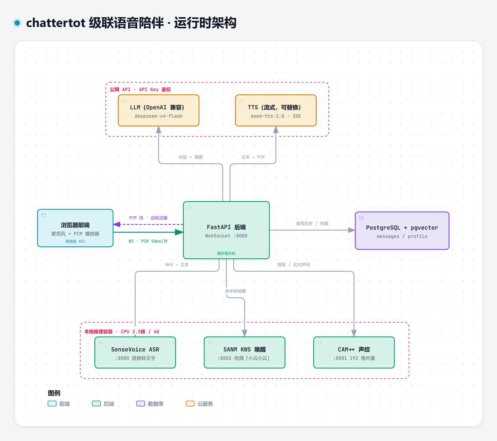

# chattertot · 会说话的小家伙

**自托管的儿童语音陪伴。**

说名字唤醒它，直接说话就能聊，想插话随时打断。算力密集的部分——语音识别、声纹、唤醒词——
全在你自己机器的 CPU 上跑；只有大模型和语音合成两处是外部调用，且都可以换成你自己部署的模型。

[English](README.md) | **简体中文**



<sub>交互版（可点节点看源码证据、支持暗色主题）：[docs/architecture/chattertot-architecture.html](docs/architecture/chattertot-architecture.html)</sub>

---

## 它能做什么

- **唤醒词** —— 说「小云小云」唤醒。把唤醒词和问题一口气说出来（「小云小云，给我讲个故事吧」）也能直接回答。
- **连续对话** —— 不用按键。它自己判断你说完没有，然后接话。
- **打断** —— 它说话时你说唤醒词，立刻停。
- **讲故事、猜谜语、唱儿歌** —— 温柔有耐心的大姐姐人设（「小云」）。
- **两层记忆** —— 短期上下文 + 长期档案（名字、喜好、家庭成员、已讲过的故事），不会重复讲同一个故事。

## 为什么这样设计

四个决定塑造了整个项目，每一个都是因为"显而易见的做法"试过并且失败了。

| 决定 | 原因 |
|---|---|
| **级联，不用端到端** | 端到端实时语音按音频时长计费，撑不住"一个小孩聊起来没完"这个形态。拆成「识别 → 大模型 → 合成」后，算力密集的部分能放本地，只有大模型和 TTS 花钱。 |
| **声纹每轮自成，不落库** | 儿童声音会随成长漂移，全局注册的声纹会越来越认不出——而且"注册"本身对小孩是个负担。改成每轮现取、用完即释放，漂移问题就不存在了。 |
| **打断用唤醒词，不用能量阈值** | 能量阈值会把环境噪音、旁人说话、甚至 AI 自己的回声残余都当成插话，导致 AI 不断打断自己。 |
| **唤醒句带问题就直接回答** | 先回一句「我在呢」会留下空档，孩子以为没被听到就重复一遍——结果得到两份回答。 |

---

## 架构

```
浏览器  ──WebSocket(PCM)──▶  FastAPI 后端  ──HTTP──▶  SenseVoice ASR
（麦克风 / 系统 AEC）        （状态机、VAD、判停）     本地 CPU，Docker
                                   │                      │
                                   ├──HTTP──▶  CAM++ 声纹 ─┤ （均为本地 CPU）
                                   ├──HTTP──▶  SANM 唤醒词 ─┘
                                   │
                                   ├──HTTP──▶  LLM（OpenAI 兼容，可自部署）
                                   ├──HTTP──▶  TTS（流式，可替换）
                                   └──SQL───▶  PostgreSQL + pgvector
                                               （对话历史 + 长期记忆）
```

| 层 | 组件 | 运行位置 |
|---|---|---|
| 前端 | 麦克风采集（系统级 AEC）+ 24kHz PCM 无缝播放 | 浏览器 |
| 编排 | FastAPI + WebSocket `:8080`，状态机、VAD/判停、声纹比对 | **宿主机** |
| 本地推理 | SenseVoice ASR `:8000`、CAM++ 声纹 `:8001`、SANM 唤醒词 `:8002` | Docker（CPU，2.5 核 / 6G）|
| 云端（可替换）| LLM、TTS | 任意兼容端点 |
| 存储 | PostgreSQL + pgvector | Docker `:5432` |

> **后端必须跑在宿主机**，不能进 Docker —— `app.py` 里的 `ASR_URL` / `SPEAKER_URL` / `KWS_URL`
> 指向 `localhost:8000/8001/8002`（[app.py:24](cascade/backend/app.py#L24)、
> [:50](cascade/backend/app.py#L50)、[:80](cascade/backend/app.py#L80)）。

**目标硬件**：AMD R5 5600X + 32GB 内存，**纯 CPU 推理**（原方案假设有 GPU，但 AMD 显卡在
Windows 上 ROCm 不可用）。推理容器限制 2.5 核 / 6G —— 它要跑三个模型，**4G 会 OOM**。

---

## 换成自己部署的模型

**LLM 和 TTS 都是薄客户端，不绑定任何厂商**；其余部分本来就是本地的。

| 想换 | 怎么换 |
|---|---|
| **LLM** | `llm.py` 走的是 OpenAI 兼容的 `/chat/completions`。把 `LLM_BASE_URL` 指向任何兼容端点即可 —— **vLLM、Ollama、LM Studio、SGLang、One-API** 都能直接用，`LLM_MODEL` 填对应模型名。 |
| **TTS** | `tts.py` 对外只有两个函数：`synthesize(text) -> bytes`（整段 mp3）和 `synthesize_stream(text) -> AsyncIterator[bytes]`（流式 24kHz 16bit PCM）。换成 **GPT-SoVITS、CosyVoice、Fish Speech、IndexTTS** 等只需重写这两个，上层状态机、判停、打断逻辑都不用动。 |
| **ASR / 声纹 / 唤醒词** | 本来就是本地自建。替换即改 `cascade/asr/` 下的服务与 `app.py` 里的 URL。 |

> 默认用 DeepSeek（LLM）和豆包 TTS，只是因为便宜，不是技术绑定。换完记得同步改 `.env`。

---

## 快速开始

**前置**：Docker、Python 3.11+、Chromium 系浏览器，以及你所用 LLM / TTS 的凭据。
以下命令**全部在仓库根目录执行**。

### 1. 下载模型

三个本地服务都读**预置的本地路径**，不靠自己联网下载。这不是优化，是必需：在国内网络下
`funasr-server --model` 会走 ModelScope 的 TCP 加速通道，**被 409 拒绝而崩溃**，所以
[start.sh:6](cascade/asr/start.sh#L6) 改成 `--model-path` 直接跳过联网。

```bash
cd cascade
./asr/download-models.sh
```

| 服务 | 落盘路径（卷内） |
|---|---|
| SenseVoice ASR | `/models/models/iic--SenseVoiceSmall/snapshots/master/` |
| SANM 唤醒词 | `/models/models/iic--speech_sanm_kws_phone-xiaoyun-commands-online/snapshots/master/` |
| CAM++ 声纹 | `/models/models/iic--speech_campplus_sv_zh-cn_16k-common/snapshots/master/` |

> `config.yaml` 和 `model.pt` 在 **`snapshots/master/` 子目录**里，不是模型根目录。路径错了服务会
> 静默起不来。脚本带落点断言，路径不对会直接报错而不是假装成功。

### 2. 起推理容器和数据库

```bash
cd cascade
docker compose up -d
```

> 首次会编译 ASR 镜像（装 CPU 版 torch + funasr），**耗时较长**。

### 3. 建表

`docker-compose.yml` 已把 `db/init.sql` 挂到 `/docker-entrypoint-initdb.d/`，**全新环境会自动建表**。
若 `pg_data` 卷已存在，初始化脚本**不会重跑**，需手动补一次：

```bash
docker exec -i chattertot-db psql -U postgres -d chattertot < cascade/db/init.sql
```

### 4. 配置

```bash
cd cascade/backend
cp .env.example .env
```

两个 Key 必填。**缺任何一个都不报错，只会静默失效**：

| 变量 | 缺失时的表现 |
|---|---|
| `LLM_API_KEY` | 播兜底话术「刚刚我没听清，你再说一遍好吗？」 |
| `TTS_API_KEY` | 有文字输出但**完全没有声音** |

### 5. 启动后端

```bash
cd cascade/backend
python -m venv .venv
.venv/Scripts/pip install -r requirements.txt        # macOS/Linux 用 .venv/bin/pip
.venv/Scripts/python -m uvicorn app:app --host 0.0.0.0 --port 8080 --ws auto
```

> macOS/Linux 把 `.venv/Scripts/python` 换成 `.venv/bin/python`。

### 6. 打开

浏览器访问 <http://localhost:8080>，点开始，允许麦克风权限，说「小云小云」。

> 需要 Chromium 系浏览器：前端依赖 `echoCancellationType: 'system'`（系统级回声消除），其他内核不支持。

### 停止

```bash
cd cascade
docker compose down          # 停止容器（保留数据卷）
docker compose down -v       # 连数据卷一起删（会丢模型和数据库）
```

---

## 核心机制

### 唤醒词：「小云小云」

待机态由 SANM KWS 模型检测，命中即转入活跃对话。随后这段唤醒音频会跑一次 ASR 并剥掉唤醒词——
若还剩内容（「小云小云，给我讲个故事吧」），就把剩余部分当作第一轮直接回答。

> KWS 模型 `speech_sanm_kws_phone-xiaoyun-commands-online` 是「小云」命令专用的 finetune，
> **只认模型自带的关键词**——换唤醒词得换模型。这是该选型的硬约束，不是配置项。

### 声纹：每轮自成，不落库

没有注册步骤。目标声纹在**本轮**由唤醒句或第一句长话确立，静默超时即释放。后续音频与之比对，
余弦相似度低于 0.5 视为旁人插话并忽略。

> 声纹需要足够时长的音频才有意义（**1.5 秒以下完全不可信**），所以打断场景**不**用声纹判定——
> 孩子打断时往往只说一两个词。

### VAD 与判停

后端进程内按 RMS 能量判说话（阈值 300），静音累计 800ms 判定一句说完。单轮音频缓存上限 10 秒。
活跃态静默 30 秒自动回待机。

### 两层记忆

| 层级 | 存储 | 用法 |
|---|---|---|
| 短期 | `messages` 表 | 最近 20 条进 LLM 上下文 |
| 长期 | `profile.facts` 字段 | 会话结束时摘要，注入 system prompt |

长期记忆靠 `last_message_id` 水位线做**增量**摘要，幂等且不会重复摘要。内容包含姓名、喜好、
家庭成员、已讲过的故事标题等。

---

## 项目状态

| 能力 | 状态 |
|---|---|
| 级联链路（ASR → LLM → TTS） | ✅ |
| 唤醒词（SANM KWS） | ✅ |
| 声纹（每轮自成） | ✅ |
| VAD / 判停 / 打断 | ✅ |
| 多轮 + 长期记忆 | ✅ |
| 模型下载脚本化 | ✅ |
| 多用户 / 声纹自动建档 | 规划中 —— [docs/记忆归属方案-多用户规划.md](docs/记忆归属方案-多用户规划.md) |
| Electron 桌面壳 | 规划中 |

---

## 目录结构

```
cascade/
  backend/          FastAPI：WebSocket 循环、状态机、VAD/判停、LLM/TTS/DB 客户端
    app.py          主入口
    static/         前端页面（由后端直接托管，无独立前端服务）
  asr/              一个容器跑三个模型服务
    download-models.sh  预下载模型到 asr_models 卷（幂等）
    start.sh            同时拉起 ASR:8000 + 声纹:8001 + 唤醒词:8002
    kws_api.py          唤醒词检测（FunASR SANM）
    speaker_api.py      声纹提取（CAM++，192 维）
  db/init.sql       建表脚本
  docker-compose.yml
  benchmark/        实测与回归脚本（见「测试」）
docs/               技术方案、调研、ADR
server/             已放弃的第一版方案，见「历史」
```

<sub>模型不是仓库里的目录——它们在 Docker 卷 `cascade_asr_models` 里（见快速开始第 1 步）。
测试录音放在 `cascade/audio-test/`，该目录被 gitignore。</sub>

---

## 测试

`cascade/benchmark/test_regression.py` 覆盖状态机：11 条断言横跨待机 / 活跃 / 播放中三态，
涵盖唤醒、唤醒词剥离、声纹确立与过滤、打断、"只说唤醒词"忽略路径。
**改动 `app.py` 后必须跑它。**

```bash
# 终端 1 —— 测试服务跑在 :8081，用独立数据库（会自动建库建表）
bash cascade/backend/run_test_server.sh

# 终端 2
cd cascade/benchmark && python test_regression.py
```

> **前置条件**：后端 `.venv` 已建好（快速开始第 5 步）、`chattertot-db` 容器在跑（第 2 步）
> ——否则 `run_test_server.sh` 会直接退出。
>
> **测试音频不在仓库里。** `benchmark/` 下**所有**脚本都从 `cascade/audio-test/` 读 WAV，
> 而该目录被 gitignore ——**包括 `test_regression.py`**。它需要四个特定文件：
> `xiaoyue_pure.wav`、`xiaoyun_full.wav`（唤醒词音频）、`verify_chat.wav`（一句较长的话）、
> `parent1.wav`（**另一个说话人**，用于声纹过滤测试）。需自备录音；缺文件时脚本会**立刻列出
> 缺哪些**，而不是跑到一半抛 `FileNotFoundError`。

**语音类测试很反直觉，两条铁律必须记住：**

1. **TTS 合成的音频不能用来验收唤醒词和声纹。** 合成语音是标准发音的送分题，真实儿童不是。
   一个在 TTS 音频上 100% 命中的唤醒词，换成真孩子可能只有一两次命中。**必须用目标说话人的真实录音验收。**
2. **声纹有 1.5 秒时长下限。** 与完整参考的余弦相似度实测：500ms → 0.06（等于随机）、
   1000ms → 0.59、2000ms → 0.94。

---

## 排障

**AI 没声音。** `TTS_API_KEY` 缺失或错误——它是静默失效的，先查这个。

**报表不存在 / relation does not exist。** `init.sql` 只在 `pg_data` 卷为空时自动执行，需手动补
（快速开始第 3 步）。

**ASR 容器日志出现 `Killed`。** 内存不足。一个容器要加载三个模型，给它 6G。
（空闲时看 `docker stats` 占用不高——**加载峰值**才是爆点。）

**Git Bash 下模型"下载成功"却消失了。** MSYS 会把 `MODELSCOPE_CACHE=/models` 转成 Windows 路径，
模型下到容器临时目录后随 `--rm` 删除，**而且不报错**。仓库脚本已内置 `MSYS_NO_PATHCONV=1`；
手动跑 docker 的话自己要设。

**识别发闷，或 AI 抢话。** 浏览器侧必须关掉 AGC（`autoGainControl: false`）并用系统级 AEC
（`echoCancellationType: 'system'`）。自动增益会放大回声残余、破坏回声消除——实测关掉 AGC 后，
播放期间麦克风能量从 700~3900 降到 0~40。不关的话，外放场景下打断基本不可用。

**外放时打断不灵。** 扬声器音量大的场景有物理极限，回声消除消不干净。用耳麦可以彻底解决。

**`funasr-server` 报 `unable to upgrade to tcp, received 409`。** 用了 `--model` 而不是
`--model-path`，见快速开始第 1 步。

**想看麦克风到底录到了什么？** 调试音频默认关闭。启动后端时带上 `DEBUG_AUDIO=1`，每轮音频会
落到 `cascade/backend/debug_audio/`。默认关闭是因为儿童语音属敏感数据，且无界落盘会占满磁盘。

**从早期版本迁移过来？** 容器名 / 库名 / 口令都可用环境变量覆盖。如果你已经在跑
`lym-asr` / `lym-db`、库名是 `lym`，建一个 `cascade/.env` 沿用旧名字即可——
否则 `docker compose up -d` 会**再起一套**并列的容器：

```
ASR_CONTAINER=lym-asr
DB_CONTAINER=lym-db
POSTGRES_DB=lym
POSTGRES_PASSWORD=lym123456
```

后端自己的连接串在 `cascade/backend/.env` 的 `DB_URL`，优先级高于默认值。

---

## 文档索引

| 文档 | 内容 |
|---|---|
| [技术方案-AI语音情感陪伴.md](docs/技术方案-AI语音情感陪伴.md) | 总方案 |
| [v1架构方案-纯CPU适配.md](docs/v1架构方案-纯CPU适配.md) | 纯 CPU 部署的架构适配与目标硬件 |
| [便宜级联方案-实施计划.md](docs/便宜级联方案-实施计划.md) | 级联路线的成本与实施计划 |
| [全球开源ASR与语音端点方案调研.md](docs/全球开源ASR与语音端点方案调研.md) | ASR / 端点检测选型调研 |
| [唤醒词方案-v1.1规划.md](docs/唤醒词方案-v1.1规划.md) | 唤醒词选型 |
| [语音对话状态机与音频前端.md](docs/语音对话状态机与音频前端.md) | 状态机设计与音频前端 ADR |
| [问题与方案讨论-声纹与判停.md](docs/问题与方案讨论-声纹与判停.md) | 声纹与判停的取舍讨论 |
| [阶段0-Benchmark实测结果.md](docs/阶段0-Benchmark实测结果.md) | 阶段 0 实测数据 |
| [记忆归属方案-多用户规划.md](docs/记忆归属方案-多用户规划.md) | 多用户记忆归属规划 |
| [问题单与待优化点.md](docs/问题单与待优化点.md) | 已知问题与待办 |
| [待确认清单-火山引擎.md](docs/待确认清单-火山引擎.md) | 火山引擎路线遗留待确认项 |

<sub>这些是开发过程中的工作文档，原样保留以便追溯推理过程。其中部分结论后来发生了变化——
见文末「文档漂移」。</sub>

---

## 历史

项目最初走的不是级联：把音频直接喂给火山引擎的 `realtime/dialogue` 端到端实时语音接口，
由它一次性完成识别、理解和合成。

**该路线已放弃**——端到端实时语音按音频时长计费，撑不住"孩子聊起来没完"的产品形态。
对应代码保留在 `server/` 供参考。

---

## 开发约定

- **改完代码必须实测**，不假设"应该能工作"。
- 用 `run_test_server.sh`（独立端口 + 独立库）验证，不要污染生产数据。
- 上面那两条语音测试铁律不是建议——它们是因为被违反过、并得出了错误结论才写下来的。

---

## 许可证

本项目**代码**采用 [MIT 许可证](LICENSE)。

**模型权重不在 MIT 授权范围内**，各有各的许可证，商用前需逐一核对：

| 模型 | 用途 |
|---|---|
| `iic/SenseVoiceSmall` | ASR |
| `iic/speech_sanm_kws_phone-xiaoyun-commands-online` | 唤醒词 |
| `iic/speech_campplus_sv_zh-cn_16k-common` | 声纹 |

LLM 与 TTS 服务（无论你指向谁）按各自的服务条款使用。

> 儿童个人信息是合规红线：本项目当前**声纹不落库、调试音频不落盘**。若将来扩展为多用户并
> 持久化声纹，需先确认符合当地儿童个人信息保护法规。

---

<details>
<summary><strong>文档漂移</strong></summary>

`docs/问题单与待优化点.md` 的部分结论写在改用 SANM KWS **之前**，其中"唤醒词方案不实用、
已决定废弃"的结论已被后续实现取代。

</details>
