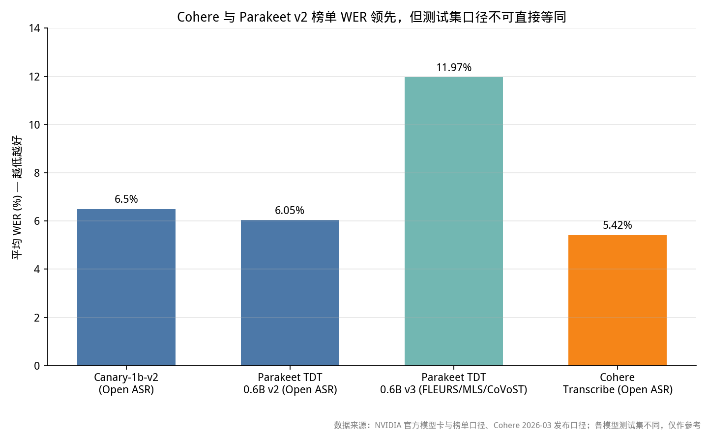
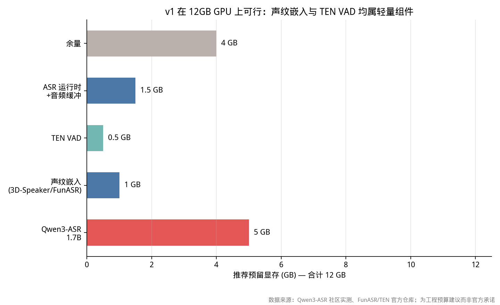

# 全球开源 ASR 与语音端点方案调研

## 摘要：v1 的最优解不是换一个更大的 ASR，而是把三层过滤的边界划清

截至 **2026 年 9 月 27 日**，全球开源语音栈已经能提供完整的三层能力，但各层成熟度严重不均：ASR 侧，NVIDIA Parakeet TDT 0.6B v3 是已验证的流式高吞吐方案（CC-BY-4.0，RTFx 3332.74，词级/段级时间戳），Qwen3-ASR-0.6B 与 1.7B 是中文儿童场景 v1 的首选（Apache-2.0、官方宣称在线推理、时间戳、儿童/老人/低信噪鲁棒）；Mistral Voxtral Realtime（4B）虽为原生流式且 480ms 延迟下对标离线精度，但其权重许可需单独核查 Acceptable Use，本报告不默认可商用，仅作观察项。痛点一是**声纹验证**，不是 TSE：v1 应先用 3D-Speaker / FunASR 说话人嵌入做"非目标说话人直接丢弃"，把 heavy 的目标说话人提取留到 v2；痛点二是**EOT**，TEN Turn Detection 虽开源（Apache-2.0 with restrictions）且中英三类状态准确率达 90%–99%，但它基于 Qwen2.5-7B，直接跑等于让 7B 语义模型常驻 v1，违反"不新增 heavy 模型"——v1 的 EOT 必须是"TEN VAD 静音时长 + 句末标点/不完整度 + 儿童语速自适应"的启发式，7B 语义兜底明确排期到 v2。儿童数据是合规红线：MyST 为 CC BY-NC-SA 4.0，禁止商用；ChildMandarin（2025 中关村论坛开源，3–5 岁中文对话）需核对具体许可条款后再决定是否用于微调，v1 先用热词/biasing 与成人数据上的小模型，不碰未核许可的儿童集。最终 v1 组合：**Qwen3-ASR-1.7B（12GB GPU）或 0.6B（8GB GPU）+ TEN VAD + FunASR/3D-Speaker 声纹 + 自适应静音启发式 EOT**；Docker 编排推荐 LiveKit Agents（Apache-2.0，官方内置语义 turn detection）+ 自托管推理容器。

## 一、模型榜单不能直接选型号：精度、延迟、流式、许可是四个独立维度

**把 WER 榜上数字相减，是这份调研里最容易误导决策的举动。** 本报告按五个档位组织模型，是因为同一档内的数字才勉强可比，跨档对比（批式 WER vs 流式延迟 vs 语言覆盖）没有任何工程意义。Open ASR Leaderboard 的平均 WER 是把多个测试集合并后的口径，NVIDIA 官方自己列出的 Canary-1b-v2 平均 WER 6.5、AMI 13.9、Earnings22 12.19、GigaSpeech 10.12、LS Clean 1.48，跨度接近一个数量级；Parakeet TDT 0.6B v3 在模型卡上给出的平均 WER 11.97（FLEURS/MLS/CoVoST），RTFx 3332.74，而社区转载的 v2 口径是 WER 6.05——同一模型家族两代数字不能直接理解为"v3 变差了"，因为语言覆盖从英语扩到 25 种欧洲语言。Cohere 官方自报 Transcribe 平均 WER 5.42，但只支持 14 种语言、且为离线批式；Qwen3-ASR 官方自报的中文/方言平均错误率 15.94 vs 豆包 ASR 19.85，测试集为其内部复杂声学集，同样不能拿来和 Open ASR 榜数字相减。

**"原生流式"与"能流式用"之间隔着一整个工程团队。** Whisper 官方把音频切成 30 秒段处理，是整段窗口模型；faster-whisper 的 `transcribe` 返回 generator 只是延迟迭代输出，不是 chunk 级在线解码；Whisper-Streaming（UFAL，MIT）用 local agreement policy 做自适应延迟，官方自报长句 3.3 秒延迟，这才是真正的流式实现。Parakeet TDT v3 原生流式参数为 `right_context_secs=2.0 / chunk_secs=2 / left_context_secs=10.0`，这是本报告找到的最清晰的流式配置口径。SenseVoiceSmall 官方不提供原生词级时间戳，v1 若依赖时间戳做 EOT 会受限；Qwen3-ASR 官方宣称时间戳精度优于 WhisperX 与 NVIDIA Forced Aligner，可作候选但需自建评测集复测。

**许可核查必须落到权重级别，不能看仓库 LICENSE 就完事。** OpenAI Whisper 代码与权重均为 MIT；Parakeet 权重 CC-BY-4.0、NeMo 代码 Apache-2.0；FunASR 代码 MIT、SenseVoiceSmall 234M 属官方模型族；sherpa-onnx Apache-2.0 runtime；TEN VAD 与 TEN Turn Detection 均为 Apache-2.0 **with additional conditions/restrictions**，商业使用前须读根目录 LICENSE；LiveKit Agents Apache-2.0 但 turn detection models 走 LiveKit Model License，需核查是否允许本地常驻商用；Mistral 权重许可需核 Acceptable Use 条款，本报告不默认可商用；Moshi 全双工对话模型 CC-BY-4.0，但官方明确需要 24GB GPU 且**不提供官方 Windows 支持**——桌面端 Docker 场景直接排除。


*图 1：Parakeet v2/v3、Canary-1b-v2 与 Cohere Transcribe 的公开平均 WER。数据来源：NVIDIA 官方模型卡与榜单口径、Cohere 2026-03 发布口径；测试集不同，仅作参考，不可作横向排名。*

附：ASR 模型全景数据表（含参数量、指标口径、许可证、流式/时间戳）——原始 CSV 未随仓库提供，如需请向作者索取。

## 二、v1 选型边界由"说话人侧"决定，而不是 ASR 精度决定

**多人误触发问题的正确解法在声学层之后，而不在 ASR 内部。** 该场景的语音链路是"麦克风 → VAD → 说话人判定 → ASR → EOT → LLM"，其中 VAD 与说话人判定都发生在 ASR 之前。这意味着一个 WER 更低的 ASR 并不能减少家长说话被识别成儿童输入的次数——家长的话已经被 ASR 完整识别成文本后才丢弃，代价是无效的推理、LLM 调用和偶发的抢答。v1 必须在声纹层就把非目标说话人归零：VAD 给出语音段后，先算 embedding 与注册儿童声纹的余弦相似度，低于阈值直接丢弃该段，不进入 ASR。这条路径不要求 ASR 做任何改动，现有 SenseVoice 基线可保留为 ASR 兜底，把 Qwen3-ASR 作为精度档切换。

**EOT 的工程本质是"延迟分布"而非"判对率"。** 静音 300ms 会把"我想…去…公园"里每个自然停顿都判成句末，造成抢话；静音 1200ms 会让快语速儿童每次回答都空等近一秒半。二者都不是准确率问题，而是把不同语速的儿童推向同一把尺子。正确做法是把静音阈值做成分位数自适应：维护过去 N 轮（建议 20 轮，可配置）中"用户实际句末静音时长"的滑动窗口，取 p50 作基础值、p90 作上限封顶，同时用 TEN VAD 的 speech/non-speech 置信度确认静音是真实语音结束而非噪声中断。任何单一固定毫秒值都不应进入生产配置。

**三层策略的判定顺序必须是"先廉价、后昂贵"，且层间要有旁路。** 声学层（VAD）成本最低，只负责"有没有人声"，误把噪声当人声的代价是多做一次 embedding；声纹层成本次低，负责"是不是这个孩子"，误接受的直接后果是家长话进入 ASR，误拒绝的后果是孩子要重说；语义层（LLM 小模型）最贵，只在"静音落在自适应区间、且文本结尾语义模糊"时调用，例如文本以"然后…""就是那个…"结尾但静音尚未达到上限。三层之间不能串行阻塞：VAD 已确认长静音时，声纹与 ASR 应并行启动，声纹结果一票否决 ASR 输出。

## 三、ASR 全景：精度档由 Cohere/NVIDIA 把持，中文儿童档 Qwen3-ASR 领先，覆盖档 Omnilingual 不可用于对话

**精度档与吞吐档是两条完全不同的产品线。** 批式精度档候选为 Cohere Transcribe（2B，Apache-2.0，14 语言，Open ASR 榜自报 WER 5.42）与 Canary-1b-v2（1B，CC-BY-4.0，25 种欧洲语言+英语翻译，平均 WER 6.5）；吞吐档为 Parakeet TDT 1.1B（RTF 3386 口径）与 TDT 0.6B v3（RTFx 3332.74）。前者适合对已有录音做离线高精转写、给 v1 做评测标注与数据清洗，后者才适合对话链路。把 1.1B 放进实时链路是配置错误——它的 RTF 优势来自一次处理长音频的批效率，不是低首字延迟。

**Qwen3-ASR 是该场景唯一在官方口径中明确点出"儿童/老人/低信噪"鲁棒性的候选。** 阿里官方对 Qwen3-ASR-1.7B 的表述是：30 种语言、22 种方言，在 20 个主流语种平均 WER 最优，内部 16 国口音英文测试集上优于 GPT-4o Transcribe、Gemini、豆包 ASR 系列；0.6B 定位高并发离线/在线推理的性价比档。官方同时宣称时间戳精度超过 WhisperX 与 NeMo Forced Aligner（NFA）。这属于**厂商自报**，需在项目自己的儿童语音测试集上复测，但至少给出了可验证的假设方向，而 Parakeet v3 的 25 种欧洲语言并不覆盖中文方言，Cohere 的 14 语言是否含方言也未给出证据。v1 建议 12GB GPU 用 1.7B、8GB GPU 用 0.6B，并保留 SenseVoice 作为 fallback（同一音频并行跑两路、0.6B 路径优先，0.6B 置信度低时取 SenseVoice 结果）。

**Meta Omnilingual ASR 是覆盖档的极端答案，但与本场景正交。** 官方仓库确认其 7B-LLM-ASR 在 1600+ 种语言上 78% 的 CER 低于 10，代码与模型 Apache-2.0，但**推理仅接受 40 秒以内音频**，无流式、无时间戳，且 CER 是字符错误率、与 WER 不可互换。它适合给小语种家庭做离线评测或长尾语言兜底，不适合 200–500ms 级实时对话。Moonshine 在本轮检索中无法定位到与 Moonshot/Kimi 直接对应的开源 ASR 仓库，存在项目名歧义（Moonshot 是 Kimi 母公司、Moonshine 是另一独立项目），**不得作为 v1 选型依据**。VibeVoice-ASR、Nemotron ASR streaming 截至核查日均无足够公开的成熟部署证据，只列观察项。

**ESPnet、WeNet、sherpa-onnx 是"运行时/工具箱"，不是某个 ASR 型号。** ESPnet 与 WeNet 均为 Apache-2.0 的训练+服务一体工具箱，WeNet U2++ 支持流式、含 AISHELL 官方 WER 5.05 口径，但它们要求自建 runtime 与服务化，不适合 v1 快速落地。sherpa-onnx（Apache-2.0）是本报告找到的最完整的轻量推理 runtime：内置 Zipformer 流式模型，覆盖中英韩法双语/单语，原生支持 VAD、说话人识别、说话人日志、关键词检测，并提供 WebAssembly 与 Jetson/树莓派/RK3588 等 CPU/GPU/NPU 支持——它是**纯 CPU 配置与端侧迁移的唯一主路径**，但模型本身的精度与语言取决于所选配方，runtime 不替你做模型选型。

## 四、儿童语音的瓶颈在数据合规，不在模型容量

**儿童声学失配是已验证事实，但开源模型公开指标几乎不覆盖它。** 儿童基频高、声道短、发音不稳、词汇量小，用成人数据训练的 ASR 在儿童数据上错误率显著上升（声学失配文献共识）；而主流模型卡给出的 WER 均在 Common Voice、FLEURS、AMI、Earnings22、GigaSpeech、LS Clean 上，这些集以成人朗读/会议/电话为主。因此任何"某模型对儿童更鲁棒"的结论，若没有儿童测试集数字，都只能标为**厂商/社区宣称**而非已验证事实。Qwen3-ASR 官方点名儿童场景是积极信号，但仍需本项目自建集验证。

**儿童语料的许可红线比模型许可更硬。** My Science Tutor（MyST）是约 400 小时儿童对话语音，CC BY-NC-SA 4.0，**NC（非商业）直接排除商用产品微调**；OGI Kids、CMU Kids、CSLU Kids、PFSTAR 多为学术语料，需逐份核对许可，本报告未取得其现行可商用结论，因此不列为 v1 训练数据；南开大学与智源 2025 中关村论坛开源的 **ChildMandarin 是 3–5 岁中文对话语音**，官方明确填补低幼儿童数据空白，但本轮未核到其具体许可文本，**列为"需法务确认后方可微调"**；AISHELL 系列是成人普通话，AISHELL-4 是多说话人会议集，MagicData 需逐子集核许可，**它们都不是儿童数据**，用来"补量"不能解决儿童声学失配。

**v1 的务实路径是热词/biasing + 成人数据上的小模型，不碰儿童微调。** 儿童陪伴场景的词汇高度收敛：角色名、情绪词（开心/难过/生气/害怕）、常见请求（讲故事/陪我玩/抱抱）、拟声词、重复词。先在 ASR 解码层挂热词表（Qwen3-ASR 官方宣称支持关键词偏置；FunASR/PromptASR 类方案亦支持），比换模型收益更直接。若必须微调，优先做法是在成人数据上训一个小适配层或 LoRA，配合儿童数据做**只评测、不训练**的独立测试集；待 ChildMandarin 许可与 MyST 商用豁免两条路至少走通一条，再做儿童侧 SFT。儿童声纹侧同理：注册音频用用户自录（用户授权），不调用任何第三方儿童语料。

## 五、VAD 选 TEN，但 EOT 必须用启发式而非 7B 语义模型

**TEN VAD 是该场景 v1 的声学层最优解，证据是定量的。** 官方仓库确认：16kHz 输入、可配 hop 160/256 样本（10/16ms）、在 LibriSpeech/GigaSpeech/DNS Challenge 人工精标集上做 precision-recall 曲线对比，结论是 TEN VAD 对 speech-to-non-speech 切换检测快，而 **Silero VAD 存在数百毫秒延迟且漏检相邻语音段之间的短静音**；RTF 在 Linux AMD 5900X 0.0150、Intel Xeon 8253 0.0136、macOS M1 0.0160、Web 端 M1 0.010。这个量级意味着 TEN VAD 可以放在音频线程里逐帧跑，不构成链路延迟瓶颈。Silero VAD 仍可作为备用/对照，WebRTC VAD（pitch-based）精度最低但 CPU 占用极小，适合纯 CPU 极端低端配置做降级；FunASR FSMN-VAD 已集成进 SenseVoice pipeline、返回带说话人 ID 与时间戳的 VAD 段（官方确认），适合"不想引入新依赖"的过渡方案，但社区/官方均未给出其 EER 或延迟指标，不能据此做横向结论。NVIDIA Marblenet 属 NeMo 训练工具箱，适合自建与调参，不是即插即用组件。

**TEN Turn Detection 是 v2 的参考架构，不是 v1 组件。** 官方页面明确它把文本分三类：`finished`（说完）、`wait`（要求暂停/终止对话的等待）、`unfinished`（明显未完成），底层是 Qwen2.5-7B transformer 语言模型做语义分析，测试集由 wait.txt/unfinished.txt/finished.txt 三部分构成，中文 finished 98.90%、unfinished 92.74%、wait 92%，英文 finished 90.64%、unfinished 98.44%、wait 91%。数字漂亮，但**在桌面端 Docker 里常驻一个 7B 模型做每个语音段的 EOT 判定，与 v1"不新增 heavy 模型"直接冲突**——它属于语义层兜底，而 v1 的语义层应当让 DeepSeek V4 Flash 顺便承担"这句是否完整"的轻量判断，或干脆用规则。TEN Turn Detection 的价值在于给出了三类状态定义和测试集结构，v1 应复刻这个状态机、替换掉 7B 模型。

**启发式 EOT 的可执行规则如下（伪代码）：**

```
state = SPEAKING
silence_ms = 0
base_ms = p50(recent_20_turn_end_silences)   # 初始化为 500ms
upper_ms = min(p90(...) * 1.5, 1500ms)        # 封顶，儿童最长等 1.5s
doubt_ms = max(base_ms * 0.7, 300ms)

on_audio_frame(frame):
    if TEN_VAD(frame) == SPEECH:
        state = SPEAKING; silence_ms = 0; emit_partial(asr.partial)
    else:
        silence_ms += frame_step_ms
        if silence_ms >= doubt_ms and text_ends_with_clause_boundary():
            emit_tentative(asr.partial)          # 预生成，不等 EOT
        if silence_ms >= base_ms and is_sentence_complete(asr.partial):
            fire EOT with confidence=HIGH
        elif silence_ms >= upper_ms:
            fire EOT with confidence=LOW          # 强制交还话权，避免空等
        elif text_looks_incomplete(asr.partial) and silence_ms < upper_ms:
            state = PAUSED_BUT_NOT_DONE           # 不抢话，不交还
```

`is_sentence_complete` 用标点（中文句号/问号/感叹号；英文 `.?!`）与句末虚词词典；`text_looks_incomplete` 用"然后/那个/就是/还有/and/so/because/..."前缀词典。标点来自 ASR 的 ITN/punc 输出——SenseVoiceSmall 不含 punc，需另接 CT-Transformer；Qwen3-ASR 官方称带标点恢复，这是它相对 SenseVoice 的另一项 v1 优势。`tentative` 预生成是关键体验手段：儿童在 300–500ms 停顿时就把"我想去公园"提前送给 LLM 生成首 token，真判停后才发出完整句，能把用户感知延迟压到接近 EOT 之前。

**打断（barge-in）必须与 EOT 对称设计。** 豆包类体验的"自然打断"本质是服务端 TTS 播放的同时持续跑 VAD：TTS 能量下降后若 VAD 检出儿童语音，立即取消剩余 TTS 队列并把新语音段送入 ASR。这一步必须叠加声纹校验，否则家长的提醒话会打断 AI 的回答。建议 TTS 播放期把声纹阈值临时下调 0.05（降低儿童"误拒绝"），但保持静音 EOT 阈值不变，避免打断后立刻把孩子的第一句判成不完整。

## 六、声纹层 v1 用说话人验证，v2 才上 TSE

**说话人验证（1:1 比对）与 TSE（多说话人中提取目标者）是两个任务，v1 只需要前者。** 声纹层的工作方式：注册阶段让孩子说 10–20 秒覆盖多个句子的音频，提取 embedding 并 L2 归一化后存库（可存 3–5 条取平均向量，抗单次录音噪声）；推理阶段对每个 VAD 语音段提取 embedding，与注册向量算余弦相似度，高于阈值才送 ASR。TSE 则是把目标 embedding 作为条件送入分离/识别网络，在频谱层做掩码，**它必须在 ASR 之前运行，且模型规模明显大于一个 embedding extractor**——FunASR-TSE 在官方 FunASR 仓库的 README 检索中未给出独立模型卡与显存数字，本轮无法确认其参数量与 8/12GB 可行性，因此 v2 接入前必须实测，不能预设"加一个轻量 TSE"。

**候选对比中 3D-Speaker 与 FunASR 嵌入最适 v1，pyannote 慎选。** 3D-Speaker（阿里，ICASSP 2025 开源工具箱，Apache-2.0 风格，含 ERes2Net/CAM++）与 FunASR 说话人嵌入（MIT，官方 pipeline 直接返回带 speaker id 的 VAD 段）的优势是同生态、模型小、可在 CPU 跑；SpeechBrain ECAPA-TDNN（Apache-2.0）研究成熟、跨场景迁移性好，但 PyTorch 依赖重；WeSpeaker 需核对具体模型许可与配方；NVIDIA NeMo TitaNet/ECAPA 属 NeMo 训练框架，适合有训练需求；**pyannote.audio 3.x 的 embedding/diarization 虽强大，但许可证含强限制，商业桌面端产品必须逐权重核查，不可默认可用**。

**儿童声纹没有公开的"最少注册秒数"标准答案，工程上取 10–20 秒、5 条取均值是合理起点。** 本轮未找到开源儿童声纹模型公布的注册时长—EER 曲线，因此不给出伪精确的"最少 N 秒"。网易云信的实践页面建议 10–20 秒（非学术来源，仅作工程参照）。注册流程应强制多句子、覆盖不同情绪（开心/低落/兴奋，儿童情绪会改变基频），且至少分两次采集（首日 + 三天后），用交叉验证测 EER 而非只存一条。阈值建议初始 0.35（余弦相似度），含义是"宁可误接受、先观察"——v1 上线初期应把所有判定结果打匿名日志（含相似度分数、是否丢弃、是否抢答），两周后用真实分布重设阈值。**注意：阈值必须在项目自己的儿童 vs 家长 vs 电视/玩具声音测试集上调，不能用公开的 VoxCeleb EER 数字外推到儿童。**

**v1 资源账能算清：声纹与 VAD 都不贵，贵的是 ASR 与 TSE 同驻。** 3D-Speaker ERes2Net 类 embedding 提取在 GPU 上通常百毫秒级、CPU 可用；TEN VAD RTF 0.01 量级；真正的显存主体是 ASR。12GB GPU 配置建议：Qwen3-ASR-1.7B 预留 5GB（社区实测 4–6GB）、声纹嵌入 1GB、TEN VAD 0.5GB、ASR runtime+音频缓冲 1.5GB、余量 4GB；8GB GPU 配置：Qwen3-ASR-0.6B 约 2GB（社区实测）+ 声纹 1GB + VAD 0.5GB + 缓冲 1.5GB + 余量 3GB。纯 CPU 配置（4GB 空闲 RAM）可用 sherpa-onnx + 量化 Paraformer 或 faster-whisper small int8，端到端 2–4 秒可接受，但 **7B 语义 EOT 与 TSE 都不应上 CPU**。


*图 2：v1 在 12GB GPU 上的推荐显存预算。数据来源：Qwen3-ASR 社区实测、FunASR/TEN 官方仓库；为工程预算建议而非官方承诺。*

附：v1/v2 资源预算表（含 CPU/GPU 配置与 EOT 降级方案）——原始 CSV 未随仓库提供，如需请向作者索取。

## 七、Docker 编排：LiveKit 是唯一明确内置语义 turn detection 的自托管框架

**LiveKit Agents 是编排层首选，因为它把 EOT 与打断做成一等公民。** 官方仓库确认：Apache-2.0、可自托管完整栈（含 LiveKit 媒体服务器，WebRTC）、支持 STT/LLM/TTS 任意组合、内置 `VAD()` 与"高级语义 turn detection（transformer 模型，减少打断）"。这是本轮检索中**唯一官方明确把语义 turn detection 作为框架能力**的开源项目。它允许把本地 Qwen3-ASR 或 FunASR 包成 STT provider、把 TEN VAD 接进 VAD 接口、把声纹判定挂在 STT 前后中间件，且天然支持打断时取消 TTS。需注意 turn detection models 走 LiveKit Model License，商用前须核条款。

**Pipecat 生态最广，但 EOT 与 Docker 需自建。** 官方列明的 STT 服务含 Whisper、Fal Whisper、FunASR、Moonshine、NVIDIA、Mistral 等，音频处理含 Silero VAD，LLM 含 DeepSeek——正好覆盖本项目技术栈。但它页面未明确 turn-taking/barge-in/endpointing 与 Docker 部署，适合作为"有团队能力、想完全自己写状态机"的选择。Faster-Whisper + WebRTC + TEN VAD 是最轻的 DIY 链路（faster-whisper 官方称比 openai/whisper 快 4 倍、8-bit 量化 CPU/GPU 均可，基于 nvidia/cuda:12.3.2-cudnn9-runtime-ubuntu22.04 官方镜像），但仅适合批式/准流式，不建议作为 v1 主路径。

**WhisperLiveKit 适合做快速原型，不适合做生产 ASR 主路径。** 它把 Whisper 流式跑在 LiveKit 上，可数小时验证"实时语音进 Docker"的链路，但 Whisper 的流式是 local-agreement 补丁、长句 3.3 秒延迟，且 Whisper 对中文儿童/方言没有针对性优势。正确用法是：用 WhisperLiveKit 两天内打通 VAD→ASR→TTS 全链路，第三周替换 ASR 为 Qwen3-ASR 容器。

**推理服务化的关键决定：vLLM 不一定适合 ASR。** vLLM 的优势在 LLM 连续批处理，而 Qwen3-ASR 是音频编码器+语言模型结构，是否受 vLLM 支持需逐版本核 GitHub issue（本轮未获官方确认），不应预设可用。更稳妥的 v1 服务形态是 **funasr-server / sherpa-onnx 风格的独立 gRPC/WebSocket 容器**：音频以 20ms 帧推送、ASR 返回 partial/final、容器间走 Docker network 内网。DeepSeek V4 Flash 若走本地 vLLM，与 ASR 容器物理隔离、独立扩缩容。ONNX Runtime（MIT）量化是消费级部署的通用加速路径：int8 动态量化显著降低 CPU 延迟与内存，CUDA EP 与 TensorRT EP 需预生成 engine 文件，分发时需按 GPU 架构打包。

## 八、v1/v2 分层架构与三层策略的落地边界

**v1 架构（一周可落地、无 heavy TSE）：**

```
[麦克风] → [20ms PCM ring buffer]
  → [TEN VAD：10/16ms hop，声学层]
  → [声纹 embedding 提取：3D-Speaker 或 FunASR，声纹层]
       ├─ 低于阈值 → 丢弃，不进 ASR（家长/他人话）
       └─ 高于阈值 → 送 ASR
  → [ASR：Qwen3-ASR-1.7B（12GB）/ 0.6B（8GB），纯 CPU 用 sherpa-onnx 量化 Paraformer]
       ├─ partial 结果 → 同时做 tentative 预生成
       └─ final 结果
  → [EOT 状态机：静音 p50/p90 自适应 + 句末标点 + 不完整词词典]
       ├─ PAUSED_BUT_NOT_DONE → 继续听
       ├─ HIGH confidence EOT → 送 LLM
       └─ LOW confidence（达 upper_ms）→ 强制交还话权
  → [LLM：DeepSeek V4 Flash 本地 vLLM，兼做"文本是否完整"的轻量判断]
  → [TTS：豆包 TTS，播放期持续跑 VAD+声纹做打断]
```

关键约束：声纹判定与 ASR 并行、声纹一票否决；TTS 播放期声纹阈值临时下调 0.05；所有判定分数打匿名日志。**v1 明确不做**：TSE 多说话人分离、7B 语义 EOT 常驻、儿童语料微调。

**v2 架构（v1 稳定、误触发数据收集完成后）：**

```
[麦克风] → [TEN VAD]
  → [FunASR-TSE：以注册儿童 embedding 为条件的目标说话人提取]
  → [3D-Speaker 声纹校验：TSE 输出再比一次，双重保险]
  → [Qwen3-ASR：接 TSE 分离后的纯净目标语音]
  → [EOT：规则 + Qwen2.5-0.5B/1.5B 语义兜底（仅上限截断时调用）]
  → [DeepSeek V4 Flash]
  → [TTS + 打断]
```

v2 的前提是实测 FunASR-TSE 的显存与时延：若 8GB 卡上 TSE + 1.7B ASR 无法同驻，则 TSE 走 CPU 或用 0.6B ASR，或在 12GB 卡上把 ASR 与 TSE 分时复用（语音段进 TSE、TSE 输出段进 ASR，链路增加约一帧延迟）。声纹与 TSE 双重校验的代价是延迟，收益是把"家长说话"从 ASR 层的文本丢弃前移到声学层的目标语音提取，且 TSE 对重叠说话更鲁棒。

**三层策略的阈值与判定逻辑（v1 推荐初值）：**

| 层 | 组件 | 判定 | 推荐初值 | 调参依据 |
|---|---|---|---|---|
| 声学层 | TEN VAD | speech/non-speech | hop 10ms（高敏）/16ms（低耗） | 桌面风扇/电视噪声环境若误触发多，加能量门限前置 |
| 声纹层 | 3D-Speaker/FunASR embedding | 余弦相似度 | 0.35 起步 | 用两周匿名日志的相似度分布重设，目标 FA（误接受）优先压低 |
| EOT 基础 | 静音时长 | base=p50 / upper=min(p90×1.5, 1500ms) | 初始 base 500ms、upper 1200ms | 每个儿童独立适配，防止一个阈值套所有孩子 |
| EOT 疑点 | 静音达 base×0.7 且遇从句边界 | 触发 tentative 预生成 | 300ms（低语速儿童）/350ms（平均） | 若预生成答错率高，上调并只保留 final |
| EOT 句末 | ASR 输出标点 | 句号/问号/感叹号 → 高置信 | 词典可配置 | SenseVoice 需另接 punc；Qwen3-ASR 原生带标点 |
| EOT 兜底 | 7B/LLM 语义 | v1 禁用；v2 上限截断时调用 | 每日每儿童上限 200 次调用 | 防止语义模型成本与延迟失控 |

**v1 的三层策略伪代码（生产可直接照抄）：**

```
def on_vad_speech_start():
    segment = start_audio_segment()
    embedding_job = executor.submit(extract_embedding, segment.future_audio)

def on_vad_speech_end(segment):
    sim = embedding_job.result()
    metrics.emit("speaker_similarity", sim)
    if sim < SPEAKER_THRESHOLD:
        metrics.count("dropped_non_target")
        return                                    # v1 核心：家长话在此消失
    asr_result = asr.transcribe(segment)          # partial → tentative 已并行发出
    if is_paused_but_not_done(asr_result.text, silence_ms):
        return                                    # 不抢话
    if silence_ms >= BASE_SILENCE and is_complete(asr_result.text):
        llm.respond(asr_result.text, priority=NORMAL)
    elif silence_ms >= UPPER_SILENCE:
        llm.respond(asr_result.text, priority=LOW) # 强制交还，避免空等

def is_paused_but_not_done(text, silence_ms):
    return (silence_ms < UPPER_SILENCE
            and ends_with_incomplete_marker(text)
            and not ends_with_punctuation(text))
```

## 九、结论：v1 用 Qwen3-ASR 替换 SenseVoice 的收益来自标点与方言，声纹层才是误触发的唯一解

**结论一：ASR 的 v1 升级点是"带标点的时间戳 + 方言覆盖"，不是榜单 WER。** Qwen3-ASR-0.6B/1.7B（Apache-2.0、官方宣称在线推理、带标点、时间戳、儿童场景鲁棒）应作为 v1 的 ASR 主路径，SenseVoice 降为 fallback。这一选择的核心理由是 EOT 依赖标点与句末语义，而 SenseVoiceSmall 不提供原生词级时间戳、不含 punc；同时 Qwen3-ASR 对 22 种方言的官方口径覆盖本项目的多语言家庭场景。Parakeet TDT 0.6B v3 与 Canary-1b-v2 留在批式评测与离线标注链路，不进实时主链路。

**结论二：家长误触发的唯一正确落点是声纹层，而不是在 ASR 文本后加过滤词。** v1 用 3D-Speaker 或 FunASR 说话人嵌入做 1:1 比对，非目标说话人语音段在 ASR 之前丢弃；注册音频 10–20 秒、多句多情绪、3–5 条取平均；阈值从 0.35 起步、两周后用真实分布重设。**TSE 明确排除在 v1 之外**——FunASR-TSE 的显存与延迟未获官方确认，且 TSE 本身是与 ASR 并列的 heavy 模型，与版本规划直接冲突。v2 才做 TSE + 声纹双重校验。

**结论三：EOT 的 v1 答案是自适应静音 + 句末语义，不是 7B 模型。** TEN VAD（Apache-2.0 with conditions，RTF 0.01 量级，官方确认 Silero 有数百毫秒延迟）做声学层；EOT 状态机用 `base=p50(recent turns)`、`upper=min(p90×1.5, 1500ms)`，叠加标点词典与不完整词词典；tentative 预生成在 `base×0.7` 且遇从句边界时触发，把用户感知延迟压到 EOT 之前。TEN Turn Detection 的 Qwen2.5-7B 与 Moshi 的 24GB 全双工模型均违反 v1 资源约束，仅作 v2 架构参考。

**结论四：Docker 编排用 LiveKit Agents，推理用独立容器。** LiveKit 是唯一官方内置语义 turn detection 的自托管 WebRTC 框架（Apache-2.0，turn detection 模型需另核许可）；ASR 以 gRPC/WebSocket 容器独立部署，支持 Qwen3-ASR 与 FunASR；CPU 场景唯一主路径是 sherpa-onnx + ONNX Runtime int8 量化。vLLM 是否支持 Qwen3-ASR 需逐版本核实，不预设可用。

**结论五：儿童数据合规是 v1 落地的前置条件，不是事后事项。** MyST（CC BY-NC-SA 4.0）禁止商用，ChildMandarin 许可条款本轮未核到，二者均不得在未取得豁免/确认前用于微调。v1 用热词/biasing + 成人数据小模型过渡，儿童语音只用于自建评测集，且注册音频一律用用户自录并走授权。

**限定与风险（影响结论使用方式）：** 数据核查截至 **2026 年 9 月 27 日**；ASR WER 因测试集不同不可横向比较，Parakeet v3 相对 v2 的"数字上升"是语言覆盖扩张所致；Qwen3-ASR 的儿童/方言/标点优势为阿里官方自报，须在本项目自建集复测；TEN 两个项目均为 Apache-2.0 **with additional conditions**，商用须读 LICENSE；LiveKit turn detection 模型走独立许可；Mistral Voxtral 权重许可未核清，未纳入 v1；小米 CocktailASR-1 发布日期（2026 年 9 月 11 日）晚于本报告核查日，属截止日后信息，**未纳入任何结论**；VibeVoice-ASR、Nemotron ASR streaming 成熟度不足；Moonshine 无法确认与 Kimi 的对应关系；FunASR-TSE 参数量、显存、EOT 指标均未取得官方数字，v2 接入前必须实测。所有"社区实测"的显存数字（Qwen3-ASR 0.6B 约 2GB、1.7B 约 4–6GB）仅作预算参考，非官方承诺。

## 引用来源

[1] https://github.com/openai/whisper
> "Whisper's code and model weights are released under the MIT License." 官方 README 给出 tiny 39M 至 large 1550M 六档尺寸与 VRAM 表。

[2] https://huggingface.co/nvidia/parakeet-tdt-0.6b-v3
> "Streaming with Parakeet models … right_context_secs=2.0 / chunk_secs=2 / left_context_secs=10.0"；"Average WER 11.97"；"Rtfx … 3,332.74"；CC-BY-4.0。

[3] https://github.com/facebookresearch/omnilingual-asr
> "Omnilingual ASR is an open-source speech recognition system supporting over 1,600 languages."；"code and models are released under the Apache 2.0"；"only audio files shorter than 40 seconds are accepted for inference"。

[4] https://github.com/kyutai-labs/moshi
> "Moshi achieves a theoretical latency of 160ms … practical overall latency as low as 200ms on an L4 GPU."；"All models are released under the CC-BY 4.0 license."；"you will need a GPU with a significant amount of memory (24GB)"。

[5] https://github.com/TEN-framework/TEN-VAD
> "TEN VAD operates on 16kHz audio input with configurable hop sizes (160/256 samples = 10/16ms)."；"Silero VAD suffers from a delay of several hundred milliseconds"。

[6] https://github.com/TEN-framework/TEN-Turn-Detection
> "TEN Turn Detection categorizes user's text into three key states: finished … wait … unfinished"；"based on the transformer-based language model (Qwen2.5-7B)"；Apache-2.0 with restrictions。

[7] https://github.com/modelscope/FunASR
> "FunASR toolkit source code in this repository: MIT License."；"SenseVoiceSmall … 234M … zh/en/ja/ko/yue"；pipeline "returns VAD segments with speaker ids and timestamps"。

[8] https://github.com/k2-fsa/sherpa-onnx
> "Use standard apache 2.0 license"；支持流式 Zipformer 中英双语模型及 "VAD … Speaker identification … Speaker diarization"；覆盖 Jetson、树莓派、RK3588。

[9] https://github.com/livekit/agents
> "The Agents framework is licensed under Apache-2.0."；"Advanced semantic turn detection: Uses a transformer model to detect when a user is done with their turn"；"Fully open-source, allowing you to run the entire stack on your own servers"。

[10] https://github.com/pipecat-ai/pipecat
> "Pipecat is an open-source Python framework for building real-time voice and multimodal conversational agents."；STT 列表含 FunASR、Moonshine、NVIDIA、Mistral；音频处理含 Silero VAD。

[11] https://github.com/SYSTRAN/faster-whisper
> "This implementation is up to 4 times faster than openai/whisper … using less memory. … further improved with 8-bit quantization on both CPU and GPU."

[12] https://github.com/ufal/whisper_streaming
> "Whisper-Streaming uses local agreement policy with self-adaptive latency"；"License: MIT license"；长句延迟官方口径 3.3 秒。

[13] https://news.nankai.edu.cn/zhxw/system/2025/04/07/030066307.shtml
> "南开大学计算机学院人类语言技术实验室(HLT Lab)联合北京智源人工智能研究院正式发布并开源ChildMandarin和SeniorTalk两大语音数据集，分别面向3-5岁低幼儿童"。

[14] https://jl.nstl.gov.cn/paper_detail.html?id=5af87ea027c5409dccc8f032d1326b05
> "My Science Tutor (MyST) … one of the largest collections of children's conversational speech that is freely available for non-commercial use under the creative commons license (CC BY-NC-SA 4.0)."

[15] https://cyber.nankai.edu.cn/2025/0411/c13342a566591/page.htm
> "ChildMandarin数据集聚焦于3-5岁儿童的中文对话语音，弥补了当前学龄前儿童语音数据的缺乏。"

[16] https://thepaper.cn/newsDetail_forward_32844550
> "Cohere Transcribe使用独立的Transformer生成转录文本……总共有20亿参数……采用开源Apache 2.0许可证。"

[17] https://news.qq.com/rain/a/20260205A04N61000
> "Voxtral Realtime 参数规模为 4B……采用流式架构，可将转录延迟压缩至200毫秒以下。"

[18] https://news.qq.com/rain/a/20260129A07SLA00
> "Qwen3-ASR-1.7B 全面超过现有开源模型……尤其在方言上，相比 Doubao-ASR 平均错误率再降 20%（15.94 vs 19.85）。"

[19] https://new.qq.com/rain/a/20221011A03IZA00
> "OpenAI 宣布，已经训练并开源了一个名为 Whisper 的神经网络……使用从网络上收集的 680,000 小时多语言和多任务监督数据进行训练。"

[20] https://news.qq.com/rain/a/20250507A04RL700
> "英伟达最新推出 Parakeet TDT 0.6B……在 Hugging Face 的 Open ASR Leaderboard 上，其字错率(WER)低至 6.05%。"

[21] https://thepaper.cn/newsDetail_forward_31944403
> "Meta此次推出的OmnilingualASR系统能识别1600多种语言……在所测试的1600多种语言中，有78%的语种其识别错误率(CER)低于10%。"

[22] https://news.qq.com/rain/a/20260911A0A54400
> "小米正式发布并开源工业级目标说话人语音识别大模型 Xiaomi-CocktailASR-1……以目标说话人的一段参考音频作为声纹提示，可在多人同时说话的复杂环境中，精准提取并仅转录目标用户的语音。"

[23] https://nb.nstl.gov.cn/paper_detail.html?id=726feea18bfffc144fde23b80e6f7b5e
> "We introduce 3D-Speaker-Toolkit, an open-source toolkit for multimodal speaker verification and diarization."（ICASSP 2025）

[24] https://finance.sina.com.cn/tech/roll/2025-05-19/doc-inexakse3031944.shtml
> "TEN VAD 是一个基于深度学习的轻量级流式语音活动检测模型……准确识别音频帧中是否有人声；判断一句话的开始和结束位置。"

[25] https://finance.sina.com.cn/tech/2021-03-16/doc-ikkntiam2846992.shtml
> "SpeechBrain 支持基于 Linux 的发行版和 macOS……支持 CPU 和 GPU。"

[26] https://www.sast.gov.cn/content.html?id=2095690496004382721
> "开源代码并不等同于‘无版权代码’或者‘可以任意使用的免费代码’……企业能否使用以及如何使用，应以具体许可证的内容为准。"
